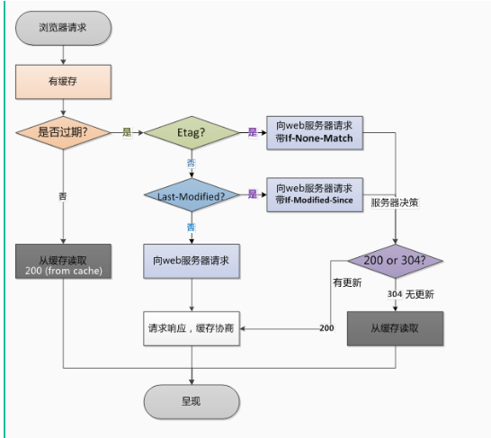

# HTTP请求

## HTTP请求头

**Last-Modified**：标示这个响应资源的最后修改时间。web服务器在响应请求时，告诉浏览器资源的最后修改时间
**Etag**：web服务器响应请求时，告诉浏览器当前资源在服务器的唯一标识（生成规则由服务器决定）
**Referer**: 告诉服务器我来自于哪里
**Authorization**:认证，http协议是无状态的， 浏览器和web服务器之间可以通过cookie来身份识别, 桌面应用程序一般不会使用cookie, 而是把 "用户名+冒号+密码"用BASE64编码的字符串放在http request 中的header Authorization中发送给服务端，来进行身份认证

## HTTP请求中浏览器缓存机制会用到的协议头？

## cookie安全机制，cookie有哪些设置可以提高安全性？

一、对保存到cookie里面的敏感信息加密
二、设置HttpOnly为true
三、设置Secure为true
四、给Cookie设置有效期
五、给Cookies加个时间戳和IP戳，实际就是让Cookies在同个IP下多少时间内失效

cookie是保存在**客户端**的
cookie是通过http请求**报头**传到服务器端
