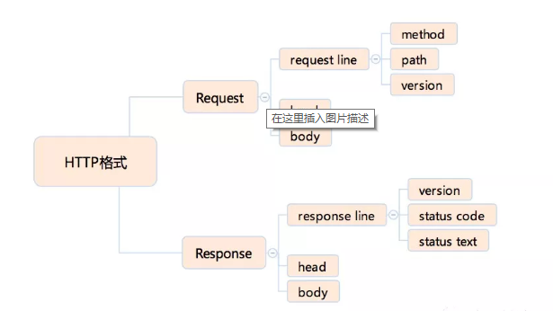
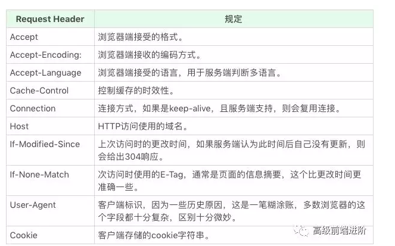
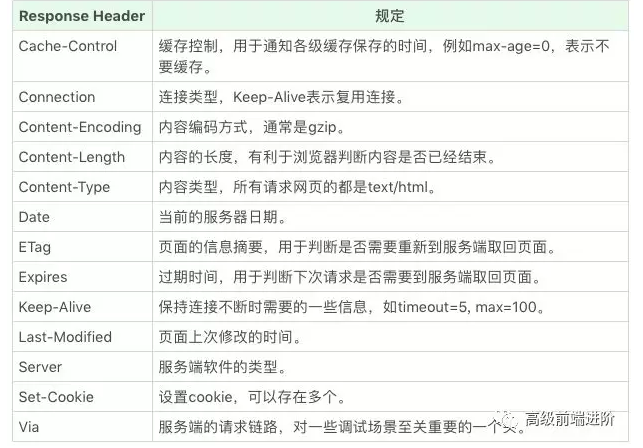

# 浏览器工作原理

1. 浏览器接受url开启一个网络请求线程

2. 浏览器发出一个完整的http请求

3. 服务器接收请求

4. 使用http请求请求页面

5. 把请求回来的html代码解析成DOM树

6. CSS的可视化格式模型解析

7. 根据css属性对元素进行渲染，得到内存中的位图

8. 对位图的合成

9. 绘制页面

## 浏览器接受url开启网络请求线程

第一点主要涉及的是**浏览器的进程**、**线程模型**以及**JS的运行机制**：

**多进程的浏览器**
大多数浏览器是多进程的，有一个主控进程，以及每一个tab页面都会新开一个进程（某些情况下多个tab会合并进程）
进程可能包括主控进程，插件进程，GPU，tab页（浏览器内核）等等。

1. Browser进程：浏览器的主进程（负责协调、主控），只有一个

2. 第三方插件进程：每种类型的插件对应一个进程，仅当使用该插件时才创建

3. GPU进程：最多一个，用于3D绘制

4. 浏览器渲染进程（内核）：默认每个Tab页面一个进程，互不影响，控制页面渲染，脚本执行，事件处理等（有时候会优化，如多个空白tab会合并成一个进程）

**多线程的浏览器内核**
每一个tab页面可以看作是**浏览器内核进程**，然后这个进程是多线程的，它有几大类子线程：

1. GUI线程

2. JS引擎线程

3. 事件触发线程

4. 定时器线程

5. 网络请求线程

## 开启网络线程发出一个完整的http请求

该部分主要包括：dns查询、tcp/ip请求构建、五层因特网等内容

### DNS查询

如果输入的是域名，需要进行dns解析成IP，大致流程：

1. 如果浏览器有缓存，直接使用浏览器缓存，否则使用本机缓存，再没有的话就是用host

2. 如果本地没有，就向dns域名服务器查询（当然，中间可能还会经过路由，也有缓存等），查询到对应的IP

### tcp/ip请求

tcp/ip请求需要了解3次握手规则建立连接以及断开连接时的四次挥手

### 五层因特网协议

## 网络通讯HTTP协议

HTTP协议是基于TCP协议出现的，
在TCP的基础上规定了Request-Response的模型，
决定了通讯必须由浏览器端发起的，首先来了解下HTTP协议的格式：

**HTTP协议格式**
HTTP协议大致可以分成以下部分：其中path是请求路径、version是固定的字符串，依次介绍下面的每个部分：


**HTTP Method 请求方法**
在requestline里面的方法部分，表示HTTP的操作类型，常见的几种请求方法如下：

1. GET：浏览器通过地址访问页面均属于get请求

2. POST：常见的表单提交

3. HEAD ：跟get类似，区别在于只返回请求头

4. PUT：表示添加资源

5. DELETE：表示删除资源

6. CONNECT： 多用于HTTPS和WebSocket

7. OPTIONS

8. TRACE

**HTTP Status code状态码**
常见的状态码有以下几种：
1xx：临时回应

2xx：请求成功，如200

3xx：请求目标有变化，如302和301表示临时和永久重定向，304表示客户端没有更新内容

4xx;请求错误，如403无权限，404访问的资源不存在

5xx：服务端错误，如500服务端错误，503服务端暂时错误等

在前端开发中，最熟悉的系列无非是大家都喜欢的200请求成功的标志，在面试中，问得较多的是304缓存问题和301、302重定向的问题

**HTTP HEAD（HTTP头）**
HTTP头可以看做是一个键值对，在HTTP标准中，**Request Header**如下图：


**Response Header**如下图：


**HTTP Request Body**
HTTP请求的body主要用于表单的提交，常见的body格式：

1. application/json

2. application/x-www-form-urlencoded:使用form标签提交的html请求，默认产生

3. multipart/form-data:当有文件上传时，使用的格式

**HTTPS**
HTTPS在HTTP的基础上增加了两个作用，
一是确定请求的目标服务端身份，
二是保证传输的数据不会被篡改或者窃听，该协议使用加密通道来传输HTTP内容，所以首先需要与服务端简历TLS加密通道。
可以在此处查看详情：<https://tools.ietf.org/html/rfc2818>

**HTTP2**
HTTP2是HTTP1.1的升级版，有两大改进：
一是支持服务端推送，
二是支持TCP链接复用：则使用同一个TCP链接来传输多个HTTP请求。
详情见:<https://tools.ietf.org/html/rfc7540>

## 构建DOM树

**字符流如何解析成词**
首先浏览器读取获取的HTML，根据指定的文件编码方式如UTF-8转换为字符流，再将字符串转换为词Token。那什么是词？词是编译原理中的最小单元，如标签开始、属性、标签结束、注释、CDATA节点。Token会标识出当前Token的种类。举个列子：

```html
<p class="a" >hello</p>
```

这里就可以拆分成<p（p标签的开始）、class="a"（属性）、 style="font-size: inherit;color: inherit;line-height: inherit;">（p标签的结束）、hello（文本）、</p>（结束标签）</p（p标签的开始）、class="a"（属性）、>

**构建DOM树**
接下来就是将词变成DOM树。在构建DOM树时，是一边生成Token一边消耗Token来生成节点的。

```html
<html>
<head>
    <title>Web page parsing</title>
</head>
<body>
    <div>
        <h1>Web page parsing</h1>
        <p>This is an example Web page.</p>
    </div>
</body>
</html>
```

**构建CSSOM**
在构建完DOM树，当前的对象只包含节点和属性，没有任何样式信息，那么浏览器是如何给DOM树添加CSS属性呢？我们知道浏览器是流式的处理整个过程，我们拿到DOM树构造好的元素，依次去检查他匹配的规则，再根据规则的优先级，做覆盖和调整。

**构建渲染树**
当CSSOM树和DOM树都得到之后，将两个树进行合并就得到了渲染树：

**布局与绘制**
当浏览器生成渲染树以后，就会根据渲染树来进行布局。在这个过程中，每一个元素都要要弄清楚各个节点在页面中的确切位置和大小，把对应的盒变为相应的位图。一个元素可能对应多个盒（如内联元素，可能被分成多行）每一个盒都对应着一个位图。合成把部分位图合成变成合成层。最终的绘制过程就是把位图合成层绘制到屏幕上。
这里提一个常见的问题，重绘和回流？具体的相关知识参考：<https://segmentfault.com/a/1190000017329980>

## 总结

构建DOM树-构建CSSOM-构建渲染树-布局-绘制